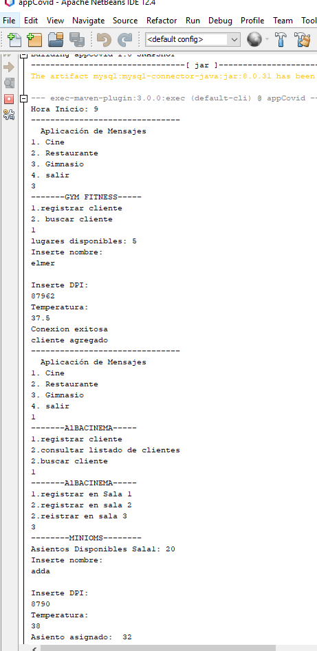

# Proyecto-gestión-cine_Restaurante_Gym

Este proyecto consiste en la gestion de un sistema de un cine, restaurante y Gym, donde se pueda gestionar los clientes que ingresan

# Funciones de la gestion del cine
-se puede crear un cliente, eliminar, y modificar los datos de los clientes
-el sistema valida si aún existen asientos disponibles
-se muestra una cartelera con la opcion de elegir que pelicula ver
-se muestra la opcion de elegir la sala

# Funciones de la gestion del Restaurante
- se puede crear un cliente, eliminar, y modificar los datos de los clientes
- El sistema valida si aún hay mesas disponibles para clientes

# Caracteristicas del sistema
-El sistema está creado para validar las distancia en base a las restricciones de la pandemia, eso quiere decir que por cada asiento en el cine y restaurante tiene que guardar distancia
-el proyecto cuenta con un CRUD para gestionar toda la informacion

# CAPTURA DE PANTALLA DEL MENU DEL SISTEMA

  

